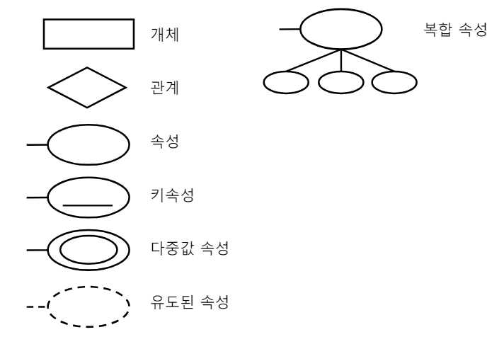

# 데이터베이스
## 데이터베이스란
데이터베이스 : 데이터를 효율적으로 관리하기 위해 **데이터 사이의 관계**를 맺어둔 파일  
  
### DB의 특징
- 자료 추상 : 복잡한 자료 → 공통적인 성질 추출
- 자료 독립 : 자료와 프로그램 간의 독립성 유지  
└ 데이터가 변경되어도 프로그램 수정 필요 X, 반대도 동일
- 자기 정의 : 자료의 구성, 내용을 DB 자체가 저장 및 관리
  
### DB의 장점
- 데이터의 논리적 독립성 : 논리적 구조가 변경되어도 DB를 이용하는 프로그램에는 영향 X
- 데이터의 물리적 독립성 : 저장 장치의 구조가 변경되어도 DB를 이용하는 프로그램 및 개념 스키마에는 영향 X
- 데이터의 무결성 유지 : 제약조건을 걸어 데이터에 결점이 생기지 않도록 유지
- 데이터 중복성 최소화 : 데이터의 중복을 사전에 통제
- 데이터 불일치 제거 : 중복을 최소화해 불일치를 제거


## DBMS
Database Management System  
데이터베이스 관리 프로그램(데이터베이스 서버)
  
### DBMS의 필수 기능
- 정의 기능 : 표 형태로 데이터를 저장하는 것
- 조작 기능 : 데이터의 검색, 갱신, 삽입, 삭제 등을 지원
- 제어 기능 : 권한 관리 등 안전성 및 정확성 유지


## 데이터 모델링
현실 데이터 구조를 컴퓨터 세계의 데이터 구조로 기술하는 논리적 구조
개념적 구조 → 논리적 구조 → 물리적 구조  
  
**스키마** : 데이터베이스의 구조와 제약조건에 관해 전반적인 명세를 기술한 것

## DB 설계
> DB 설계 과정
> 요구 분석 → 개념적 설계 → 논리적 설계 → 물리적 설계 → 구현

**요구 분석** : DB 주요 사용자 결정 및 수행 업무 분석 후 다양한 방법을 통해 요구 사항 파악  
**개념적 설계** : 데이터를 구조화, 정형화시키는 과정 *ex) E-R 다이어그램*  
**논리적 설계** : 개념적 스키마를 논리적 구조로 표현하고 정규화 과정( *ex) OSI 7계층* ) 수행
**물리적 설계** : HW나 OS의 특성을 고려해 저장 구조나 인덱스 구조 등 물리적 구조 설계


## ERD
E-R 모델 : 현실 세계의 개체와 개체 간의 관계를 이용해 개념적 구조로 표현, ERD로 작성 가능
- ERD 구성 요소
 


## 개체
**개체** (Entity)  
데이터로 DB에 저장할 가치가 있는 중요한 사람이나 사물, 개념, 사건 등
각 개체는 고유한 특성이나 상태를 나타내는 **속성**을 1개 이상 갖고 있음  
  
**속성** (Attribute) : 개체나 관계가 갖고 있는 고유의 특성
DB에 저장하는 데이터의 가장 작은 **논리적 단위**


## 관계
서로 다른 개체가 맺고 있는 의미 있는 연관성, 대응 관계  
  
관계의 유형
- 일대일(1:1) 관계
- 일대다(1:n) 관계
- 다대다(n:m) 관계


## 관계 데이터 모델
데이터를 논리적 릴레이션 구조로 구성  
  
릴레이션 : 데이터 저장의 형태가 2차원 구조의 테이블
**속성(Attribute)** : 테이블의 각 열을 의미
튜플 : 테이블의 한 행을 구성하는 속성들의 집합

### 릴레이션의 특징
하나의 레코드 타입만 저장 *ex) 학생 릴레이션 → 학생 정보*
하나의 속성 내 값은 유형이 동일
순서 중요 X
한 릴레이션 안에 속성 이름이 중복 X
동일한 행이 존재 X
한 행의 각각의 속성은 원자값을 가짐, 리스트나 집합 X


## 키
DB에서 조건에 만족하는 행을 찾거나 정렬할 때 다른 행들과 구별할 수 있는 유일한 기준이 되는 속성  
  
- 슈퍼키 : 유일성은 갖지만 최소성 X 속성의 집합
- 후보키 : 유일성과 최소성을 갖는 속성의 집합
- **기본키(`Primary Key`)** : 행을 유일하게 식별할 수 있는 속성의 집합
- 대체키 : 기본키를 제외한 후보키
- **외래키(`Foreign Key`)** : 다른 테이블을 참조하는데 사용되는 속성  
  └ 외래키 속성이 참조하는 테이블에서 기본키 속성


## 관계 데이터 제약
DB에 저장된 값이 일치하는 정확성을 **데이터 무결성**  
  
- 개체 무결성 : 기본키의 속성은 NULL과 중복 X
- 참조 무결성 : 외래키는 NULL이거나 참조하는 릴레이션에 있는 기본키
- 도메인 무결성 : 특정 속성의 값은 속성에 정의된대로 값만 허용


## 사상
사상 (Mapping) : ERD를 릴레이션 형태로 바꾸는 과정  
  
> **사상 규칙**
> 1. 개체는 하나의 릴레이션
> 2. 다대다 관계는 하나의 릴레이션으로 변환
> 3. 일대다 관계는 외래키 속성으로 표현
> 4. 일대일 관계는 외래키 속성으로 표현
> 5. 다중 값 속성은 다른 릴레이션으로 변환


## 실습
- 리눅스 컴퓨터
1. DB 서버 프로그램 설치(`yum install mariadb-server`)
2. DB 서버 프로그램 실행 (`systemctl start mariadb`)
3. 방화벽 끄기
4. 클라이언트 프로그램 실행(`mysql`)
``` sql
CREATE USER '[이니셜]'@'%' IDENTIFIED BY 'qwer1234' //사용자 생성
CREATE DATABASE [DB 이름]; // DB 생성
GRANT ALL PRIVILEGES ON [DB 이름].* TO '[이니셜]'@'%'; // 사용자한테 DB 관리 권한 부여
```  
  ---
- 윈도우 컴퓨터
1. DB클라이언트 프로그램 설치 → mysql workbench 설치

2. 워크벤치에서 서버로 접속
> connection name : 아무거나
> Hostname : 리눅스 컴퓨터 IP
> Port : mariadb-server의 포트번호 **3306**
> Username : [이니셜]


## 정규화
이상 문제 해결을 위해 속성 간 관계 분석, 릴레이션 분해하는 과정  
데이터의 중복성을 최소화  
  
### 이상
속성 간에 존재하는 여러 종속 관계를 하나의 릴레이션에 표현함으로 인해 발생하는 현상  
  
- **삽입** 이상 : 불필요한 정보가 함께 삽입
- **삭제** 이상 : 행을 삭제해 유지되어야 하는 정보까지 삭제
- **갱신** 이상 : 중복된 행 중 일부 속성만 갱신해 정보의 모순성 발생


## 정규화 과정 (원부이결다조)
함수적 종속이 있는지 우선 확인
└ 특정 행에서 한 값(x)이 다른 값(y)을 함수적으로 결정하면 Y가 X에 함수적 종속 되었다라고 함  
  
제1 정규형 : 도메인이 모두 원자값이어야 함 (한 행에서 하나의 속성에는 한가지 값만 존재)
제2 정규형 : 부분 함수 종속 제거
제3 정규형 : 이행 함수 종속 제거 (X → Y, Y → Z ⇒ X → Z)