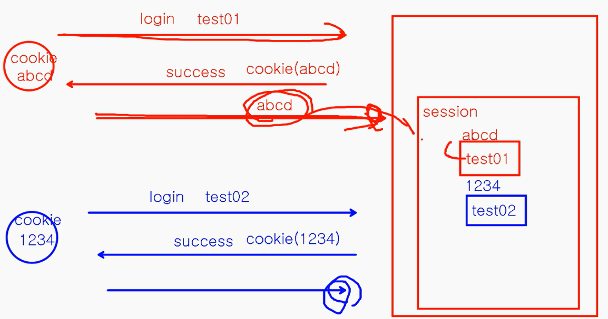

URL : 파일의 위치를 찾아가는 주소  
URI : 특정 ID를 찾아가는 주소  

## 커넥션 풀
미리 데이터베이스 연결을 여러 개 생성해두고 필요할 때마다 사용하고 반환하는 방식 *ex) Hikari*  
매번 새로운 연결을 생성하고 종료하는 데 드는 비용을 절약   
새로고침을 하더라도 **미리 생성된 DB 연결**을 재사용하기 때문에 연결이 쌓이지 않음  
  
- db 연결만 : 새로고침 할 때마다 DB 연결이 하나 생성, 연결이 계속 쌓임  
- db 연결하고 끊음 : 사용 다 하면 연결 종료  
  
- DBCP 적용(싱글톤X) : 새로고침 할 때마다 DB 연결이 10개 생성, 연결이 계속 쌓임  
- DBCP 연결하고 끊음 : 새로고침 할 때마다 DB 연결이 10개 생성, 연결이 계속 쌓임  
  
- DBCP 적용 (싱글톤 O) : 새로고침 할 때만 DB 연결이 10개 생성, 10개 연결을 다 쓰면 다음 사용자는 접속 X  
- DBCP 연결하고 끊음 : 새로고침 할 때만 DB 연결이 10개 생성, 연결을 다 쓰면 반납  

## 동시성 제어
스레드 세이프 : 각각의 스레드가 순차적으로 작업을 수행했을 때와 동시에 작업을 수행했을 때 결과가 같은 것  
**synchronized** : 메소드나 블록을 동기화하면 한 번에 하나의 스레드만이 해당 코드를 실행  
**Volatile** : 모든 스레드가 각자의 캐싱이 아닌 메인 메모리에서 직접 변수를 읽고 쓰게 함  
한 스레드가 변수를 수정하면 다른 스레드에게 즉시 반영  

## 상태 정보
Stateful : 서버가 클라이언트의 상태를 저장  
Stateless : 서버가 클라이언트의 상태를 저장 X  
**쿠키** : **클라이언트** 프로그램에 특정 데이터를 저장해두는 것  
**세션** : **서버 프로그램**에 특정 데이터를 저장해두는 것  
  
  
1. 서버에서 클라이언트를 식별하는 세션 ID를 발급해 클라이언트로 전송  
2. 클라이언트에서 세션 ID를 쿠키로 저장  
3. 클라이언트에서 요청할 때마다 쿠키를 함께 전송  

## +) 보안
입력 값 검증 : 사용자가 입력하는 모든 값들을 믿어서는 X   
  
- 웹 개발자가 알아야 할 공격 기법  
    - SQL Lnjection  
    - XSS  
    - CSRF  