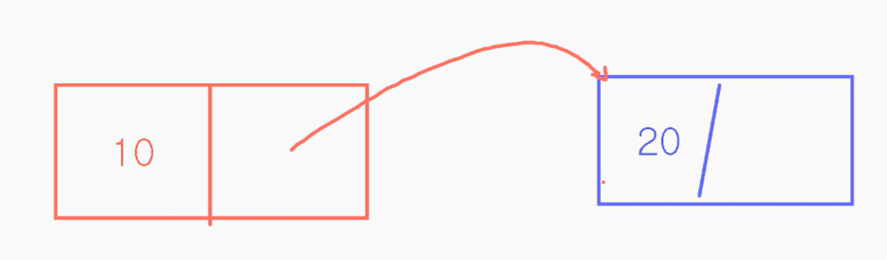

## 스택
LIFO 방식으로 가장 최근에 들어온 데이터가 가장 먼저 나감  
데이터를 삽입, 삭제하는 연산이 한쪽에서만 진행  

### 스택 구현
배열을 이용해서 숫자를 여러개 저장할 수 있게 변수 생성  
배열에 직접 접근해서 숫자를 저장할 수 있으면 안되기 때문에 **접근 제어자**로 제어  
숫자를 어디까지 저장했는지 가리키는 변수 top 생성  
- `push()` : 데이터를 저장하는 연산  
저장할 데이터를 전달 → 스택이 가득차 있지 않으면 top 1 증가 → 해당 위치에 데이터 저장  
- `pop()` : 데이터를 삭제하는 연산  
스택이 비어있지 않으면 top 인덱스의  배열에 값을 꺼냄 → top 인덱스 번호의 배열 값을 비워줌 →  top 1 감소  
- `peek()` : 제일 마지막에 저장된 값을 출력  
- `display()` : 스택에 저장된 모든 데이터를 출력하는 기능  
- `isEmpty()` : 스택에 값이 비어있는지 확인(`boolean`)  
- `isFull()` : 스택에 값이 다 차있는지 확인(`boolean`)

### 스택의 활용
- 데이터 거꾸로 정렬  
- **사칙연산 계산기(후위 표기법)**  
*ex) 3+2*4-9/3(중위 표기법) →  324**93/- (후위 표기법)*  
**후위 표기법으로 변경**  
1. 숫자는 바로 출력
2. 연산자가 오면 스택에 넣음
3. 스택에 넣을 때 우선순위를 비교해 현재 연산자가 더 높으면 그대로, 낮거나 같으면 기존에 있는 연산자를 빼고 넣음  
  
**후위 표기법 사칙연산 계산**  
1. 맨 앞부터 차례대로 스택에 넣음
2. 연산자를 넣을 때가 되면 스택에 저장된 데이터 2개를 꺼내서
3. 2번 연산자 1번 순으로 계산 후 계산 결과를 스택에 넣음

## 연결 리스트
숫자를 하나 전달 받아 마지막에 저장하는 기능

### 단일 연결 리스트
마지막에 추가한 노드를 저장하는 변수 : `tail`  
  
- 구조  

if 저장한 적이 있으면  
노드 생성을 생성해서 변수에 저장  
생성한 노드의 데이터에 전달받은 숫자를저장  
tail의 다음 노드에 현재 생성한 노드를 저장  
tail에 현재 생성한 노드 저장  
  
그렇지 않으면  
노드 생성을 생성해서 변수에 저장  
생성한 노드의 데이터에 전달받은 숫자를 저장  
tail에 생성한 노드 저장  